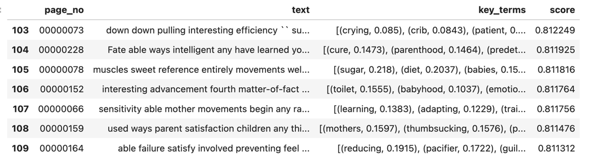
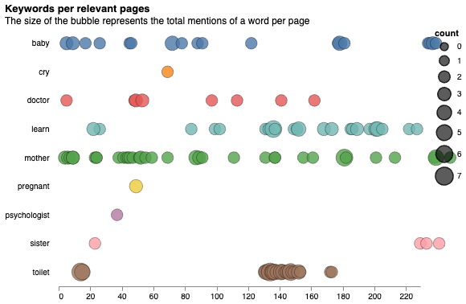

# Finder and Visualizer relevant pages in a book

This contains aa notebook that prototypes an application that finds the most relevant pages in a book
that match a query string.
As input, you should define a query string and the id of the volume you want 
to extract the relevant pages.

This prototype was created for the [2024 HathiTrust TorchLite hackathon](https://htrc.github.io/torchlite-hackathon/) project by: Lianet Sepulveda Torres.

## Potential Use Cases

In the digital library, the user cannot access books that are not 
public access, then the user sees the record in the list of the query results but cannot see the full text. When the user 
clicks to see the book's content, the user can see the book's title and a message advising the book is not public.

Instead of showing the message advising the book is not public, we could present some information about the book without
showing the full text. For example, 
 * we could show the user the most relevant pages in the book that match the query string.
 * a cloud of words that are most relevant to the book

# Methodology

* Use [HTRC extracted features (EF) dataset](https://htrc.github.io/torchlite-handbook/ef.html) to get the text with enriched metadata (text annotation with linguistic features)
* Analyze the book at page level.
  * Filter out non-relevant words (stop words)
  * Create a text putting together all the words in the page
  * Use KeyBERT('distilbert-base-nli-mean-tokens') to extract the top 10-words of a text. 
  KeyBERT is based on a technique to extract keywords that represent the plain text as a document embedding and 
  using cosine similarity find the words/phrases that are the most similar to the document. 
  The most similar word could be considered the best candidate to describe the entire document.
* Identify the most relevant pages based on similarities between the query string and the keywords at page level.
* Filter out pages with a score less than 0.83.
* Lemmatize the words using the root of the word to improve visualization.

# Data
We are using the EF API to get the dataset of the volume _osu.32436000578904_.

# Datasets
The notebook creates datasets that are used for visualizations: 
    * A list of pages that are most relevant to the query string.
    * Each page is enriched with a score
that measures the similarity between the query string and the keywords extracted from the page.
    * The list of the top 10 keywords per page.

# Outputs

Relevant pages dataset:
    * For each page
        * text of the page.
        * score that measures the similarity between the query string and the keywords extracted from the page.
        * 10 keywords extracted from the page.

The relevant pages dataset is used to create the following visualizations:

